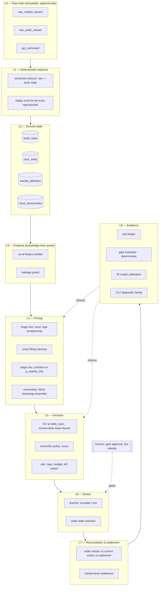

# Betfair Racing Research Platform — Master Specification

**Version:** 1.1
**Status:** Conditionally approved for offline implementation through Phase 2. This
approval authorises NO live Betfair credentials, NO API order submission, NO real-money
activity, NO passive-execution claims, NO dynamic model updates, NO Kelly sizing, and NO
production deployment. Those remain HALTED until their gates are satisfied and separately
approved.
**Audience:** Claude Code (seeing this project for the first time), and any human auditor.
**Changelog:** v1.1 splits the circular Gates −1 and 0; removes the dummy-signal
contradiction; makes the manifest phase-aware; replaces the invalid universal
vary-with-input property; makes v1 crossing genuinely taker-only (FOK); corrects Gate 2's
"actual crossable prices"; gives statistical gates four outcomes; freezes the three-price
definitions; defines canonical (not bit-exact) replay; adds the pre-outcome universe
ledger; adds licence taint to model lineage; hardens CI against self-attestation;
prohibits automatic live learning; moves volatile facts to a dated registry.

---

## 0. READ THIS FIRST

You are building a **research and measurement platform** that may, later, and only if the evidence supports it, become a betting system. You are not building a betting bot. The distinction is not rhetorical — it determines what "done" means.

This specification has survived three rounds of adversarial audit. Many things that look like reasonable simplifications have already been considered and explicitly rejected, usually because they quietly destroy the evidence the platform exists to produce. **If a requirement looks unnecessary, assume it is load-bearing and ask before removing it.**

### The three rules that override everything else

1. **Never implement a stub, placeholder, constant, or "simplified for now" version of any requirement in `risk/`, `settlement/`, `gates/`, `pricing/`, or `fill/`.** If you cannot implement something fully, STOP and report which SPEC-ID is blocked and why. A missing feature is recoverable. A silently degraded one is a landmine that may not surface for months, by which point it will have corrupted every conclusion drawn since.

2. **Never weaken, delete, or alter a test solely to accommodate an implementation.**
   Tests are the specification made executable; changing them to fit the code inverts the
   point. If a test or its underlying requirement is believed to be *wrong* (it
   misunderstands an API, encodes a mathematical error, or contradicts another
   requirement), STOP implementation. Correct it only in a **separate
   specification-correction change** that identifies the affected SPEC-ID, explains the
   error, receives human approval, and adds or preserves a regression test demonstrating
   the corrected behaviour. Implementation resumes only after that change is merged.
   Test corrections and implementation changes go in separate commits. A gate formula and
   the evidence being evaluated by that gate must never change in the same PR.
   *(Note: `CLAUDE.md` states this as an absolute — "never modify a test." That is
   deliberate. A nuanced rule degrades under context pressure into "I judged this test
   wrong." The blunt form goes where the agent reads it under load; the governed process
   lives here, where a human reads it deliberately.)*

3. **An LLM never estimates a probability, prices a bet, or sizes a stake.** Not as a fallback, not as a placeholder, not "temporarily until the model is ready." All numerical decisions come from deterministic, tested code. You are the builder and the auditor. You are not the model.

### What is expected to happen

The most likely outcome of this project is that **no exploitable edge is found**, and the platform's job is to establish that cheaply, quickly, and honestly, rather than expensively and slowly. The UK/Irish horse racing exchange market is highly efficient. Professional syndicates with better data and more capital operate in it. The first several model versions are expected to fail their gates. That is the system working, not the system broken.

Treat every surprisingly good backtest result as a suspected bug until it survives independent verification. Historically, "the backtest looks great" is the single most reliable indicator of a defect in this class of system.

---

## 1. What this is, in one paragraph

A platform that ingests Betfair Exchange market data and horse racing form data for GB all-weather flat racing, builds a two-stage statistical model that combines fundamental handicapping with the market's own implied probabilities, and then rigorously tests whether that combined model can identify mispriced runners at prices that were **actually executable**, after commission, with enough statistical confidence to justify risking money. Every stage is gated. No stage may be skipped. The platform is deliberately designed to prove itself wrong as cheaply as possible.

---

## 2. Scope

### In scope (v1)

| Dimension | Decision |
|---|---|
| Venue | Betfair Exchange only |
| Sport | Horse racing |
| Region | GB all-weather flat (Lingfield, Wolverhampton, Southwell, Newcastle, Kempton) |
| Market | WIN markets only |
| Direction | **Back only** |
| Timing | **Pre-off only.** No in-play, ever. |
| Position lifecycle | **Hold matched positions to settlement.** No hedging, no offsetting lay, no green-up. |
| Execution | One execution policy per candidate. Marketable limit orders (crossing) in v1. |
| Positions per market | **One runner per market** until market-level portfolio sizing exists |
| Staking (v1) | Fixed minimum stake. Not Kelly. |

### Explicitly out of scope

- **In-play trading.** Court-siders and low-latency firms own that space. You will lose.
- **Passive/maker execution** — deferred to Gate 4 as a *separately proven* strategy. See §6.
- **Lay betting.** Including SP lays (£10 minimum liability = 10% of a £100 bank).
- **Hedging or trading out.** Positions are held to settlement.
- **Multiple runners in one market.** Commission is charged on the net market result; multi-runner positions make commission attribution path-dependent. Not until market-level portfolio sizing is built and tested.
- **Kelly staking at launch.** See §7.
- **Tennis, football, any other sport.** Extension points may be noted in code comments. No implementation.
- **Any LLM in the pricing, staking, or execution path.**

### Deferred, with explicit trigger conditions

| Item | Trigger |
|---|---|
| Passive execution experiment | Gate 3 passed (live taker canary reconciles cleanly) |
| Kelly-family sizing | Gate 5 passed (live net value established) |
| Multi-runner markets | Market-level portfolio sizing implemented + tested |
| Other sports | v1 has passed Gate 5 and been running stably |

---

## 3. Why the architecture is shaped this way

Four findings from the audits drive nearly every structural decision. Understanding them will prevent you from "simplifying" something important.

### 3.1 Taker-first falsification

**If the model only makes money on simulated passive fills, you are modelling your simulator, not the market.**

Passive (maker) execution earns a better price but risks not being filled — and crucially, the orders that *do* fill are disproportionately the ones where the market moved against you (adverse selection). A simulator that gets queue dynamics slightly wrong will systematically overstate passive profitability, because it cannot see the cancellations that determine your true queue position.

Therefore: **prove the pricing model has positive conservative expected value at immediately executable (crossable) prices first.** Only if that holds may passive execution be introduced, and then only as a separately-proven improvement to an already-viable signal. Passive execution must never be the source of the *first* evidence of viability.

### 3.2 Queue position is a latent variable and cannot be recovered from historical data

Betfair's ADVANCED historical data sends no explicit cancellation message. When a top-of-book update conflicts with the prior state, the previous order was either matched **or** cancelled — and the data cannot distinguish them. PRO data (higher frequency) reduces interval censoring but does **not** provide order identities, your position in a queue, or the sequence of cancellations at a price level.

Therefore: **there is no "queue position" to compute.** The fill model outputs *probabilities* with uncertainty, not a fictional exact queue position. And the only source of truth about your actual fills is **your own live orders**.

### 3.3 Shadow mode cannot produce actual fills

flumine's paper trading routes orders through simulated execution against the current market book. It does **not** submit them to Betfair's matching engine. Shadow mode therefore gives you simulated fills on live prices — which is useful — but not actual queue entry, actual partial fills, actual priority, actual cancellation races, or actual adverse selection conditional on being matched.

Therefore: any gate requiring "simulated vs actual fill divergence" requires **real orders**. This is why the live canary (Gate 3) exists and why it cannot be replaced by more shadow trading.

### 3.4 Races are the unit of analysis, not runners

Runners in a race form one mutually exclusive choice set — exactly one wins. Races at a meeting share going, weather, jockeys, trainers, liquidity regime, and market participants. Treating runners as independent observations produces standard errors that are far too small and confidence that is unearned.

Therefore: **the primary unit is the race.** Inference is paired at race level with block bootstrap clustered by meeting-day. "2,000 selections" is not 2,000 independent observations; it may be a few hundred independent decisions.

---

## 4. The three prices (frozen definitions, not researcher discretion)

A recurring source of error is treating "the market price" as one thing. It is three, and
each has a **versioned, frozen definition committed before any performance is examined.**

**Changing `p_market_info` after seeing results is changing the model.** Offering
"normalised midpoint or microprice" as interchangeable alternatives is researcher
discretion over the single most important model input. Alternatives are separate
pre-registered experiments, not implementation choices.

| Name | What it is | Used for |
|---|---|---|
| `p_market_info` | Market-derived probability, per the frozen spec below | Input to stage-two combination |
| `odds_exec` | Price and size **actually transactable now**. Side- and size-specific. | EV calculation, order placement |
| `p_close` | BSP, or defined pre-suspension WAP window | Post-hoc diagnosis **only** |

These are **distinct types**. The type system must prevent passing `p_close` or
`p_market_info` where `odds_exec` is required (SPEC-051).

### 4.1 `specs/prices/info-price-v1.yaml`

```yaml
information_price:
  version: info-price-v1
  source_state:            # latest fully reduced book received before decision_time
  max_age_ms:              # stale-data threshold — REQUIRED
  tie_break_policy:        # exact book state when multiple updates share a timestamp
  active_runner_policy:
  one_sided_book_policy:   # treatment of one-sided books
  crossed_book_policy:     # treatment of crossed books
  probability_space:       # implied_probability | odds  — MUST be explicit
  midpoint_formula:        # taken in WHICH space — REQUIRED
  normalization_formula:   # how active-runner probabilities are normalised
  spread_adjustment:       # how spread and available size affect p_market_info
  missing_runner_policy:
  non_runner_policy:
```

At minimum, the frozen spec must state: whether the midpoint is taken in odds or
implied-probability space; how active-runner probabilities are normalised; treatment of
one-sided or crossed books; the stale-data threshold; the exact book state selected when
multiple updates share a timestamp; and how spread and available size affect the value.

### 4.2 `specs/prices/exec-price-v1.yaml`

```yaml
execution_price:
  version: exec-price-v1
  side: BACK
  size: fixed_canary_stake
  ladder_depth_policy:
  worst_acceptable_tick:   # the price is a WORST ACCEPTABLE bound, not "cross at any price"
  latency_assumption_ms:
  insufficient_depth_policy:   # reject, do not partially fill
```

### 4.3 `specs/prices/close-v1.yaml`

```yaml
closing_benchmark:
  version: close-v1
  primary: BSP
  secondary:
    type: pre_suspension_wap
    window_seconds:
    inplay_updates_excluded: true
```

Both benchmarks are retained. BSP is a strong benchmark, not an oracle — in a market that
assimilates information as fast as UK racing does, small changes in benchmark definition
move conclusions.

## 5. System architecture



**The critical property:** L2 and everything above it must be **reproducible from L0 plus a versioned reducer**. If you cannot replay raw events and get bit-identical derived state, the platform's evidence is not trustworthy and nothing above L1 means anything.

---

## 6. Component specifications

### 6.1 L0 — Raw truth layer

The event store's source of truth is **raw bytes as received**, not derived tables. A three-level book snapshot in a JSON column is a *derived artefact*, not truth.

```
raw_market_stream
  - payload_bytes          (bytes, exactly as received)
  - publish_time           (from Betfair)
  - receive_time_utc       (wall clock at receipt)
  - receive_time_monotonic (monotonic clock — immune to NTP adjustment)
  - stream_clock
  - connection_id
  - subscription_hash
  - conflation_settings
  - schema_version
  - checksum

raw_order_stream
  - payload_bytes
  - publish_time
  - receive_time_utc
  - receive_time_monotonic
  - stream_clock
  - connection_id
  - checksum

api_command
  - command_id
  - customer_ref
  - customer_order_ref
  - signal_id
  - payload_hash
  - local_send_time
  - response_time
  - response_payload
  - retry_parent_id
  - process_version
```

**Why monotonic clocks:** wall-clock time can jump backwards (NTP). Any latency measurement using wall clock is untrustworthy. Store both.

### 6.2 L1 — Deterministic reducers and **canonical** replay

A versioned pure function: `reduce(raw_events, reducer_version) -> book_state`.

**"Bit-exact" is unachievable unqualified.** Byte-identical output depends on container
and OS, Python and native-library versions, reducer version, serialisation format, field
ordering, sort stability, Decimal representation, timezone and locale, compression
settings, and file metadata. Promising it without fixing all of those is a promise that
will be quietly broken.

**Two guarantees instead:**

1. **Same approved environment.** Identical `raw_manifest_digest` + `reducer_digest` +
   `config_digest` + `container_digest` MUST produce the same **canonical output hash**.
2. **Cross-version migration.** A newer reducer MUST satisfy a versioned
   semantic-equivalence suite, or explicitly produce an approved state migration.

**"Raw bytes exactly as received"** means the **Betfair application message bytes captured
before parsing** — not encrypted TLS wire bytes.

**Monotonic clocks are only comparable within a process/boot clock domain.** They are not
globally comparable across restarts or hosts. Raw capture therefore also records:
`host_id`, `boot_id`, `process_id`, `capture_sequence`, `process_start_utc`,
`monotonic_origin_ns`, `raw_partition_id`, `raw_partition_hash`.

API commands carry **both clocks on both events**: `send_time_utc`, `send_time_monotonic`,
`response_time_utc`, `response_time_monotonic`.

### 6.3 L3 — Knowledge-time semantics

For every feature, distinguish **six** timestamps:

| Timestamp | Meaning |
|---|---|
| event time | when the thing happened |
| source publication time | when the provider published it |
| provider timestamp | provider's own claim about when |
| ingestion receive time | when you received it |
| **first usable time** | when it was *actually knowable to you* |
| decision time | when the model used it |
| correction time | when a later revision arrived |

**A retrospective ratings file does not become historically valid because you populated a `first_seen_ts` column during backfill.** If a rating was published after the race, it is not a feature. If you cannot prove a value was knowable before the off, it does not go in the model.

**Specific leakage traps:**
- Reconciled BSP must never enter a pre-off feature. Join it at grading time only.
- "Seconds to actual off" is not knowable live — races are delayed. The live model knows *scheduled* start and current market state. Historical actual-off is for post-hoc analysis only.
- Post-race data (finishing position, sectional times from the race being priced) is obviously out. Sectionals from *prior* races are fine.

### 6.4 L4 — Pricing

**Stage one — conditional logit (baseline).** Models the race as one mutually exclusive choice set; probabilities sum to 1 within the race; handles varying field sizes natively. Estimated by maximum likelihood on the winner.

Known limitation: independence of irrelevant alternatives (IIA). Relative odds between two horses are invariant to the rest of the field — which is wrong exactly where pace configuration and field interactions matter. Documented, accepted for v1, addressed in the progression below.

**Progression (each step must earn its place on held-out race-level score):**
1. Regularised conditional logit
2. + field and pace interactions
3. Hierarchical / mixed-effects choice model
4. Grouped probabilistic boosting (grouped softmax/cross-entropy objective, **not** LambdaRank scores passed through a softmax — LambdaRank optimises ranking, not calibration; softmaxing its scores does not produce coherent probabilities)
5. Ensemble — only after each component adds held-out value

**Stage two — market combination.** Combine the out-of-fold fundamental probability with the market's implied probability:

```
score_i = α·log(p_fundamental_i) + β·log(p_market_info_i)
c_i = softmax(score)_i
```

α and β estimated by maximum likelihood on the winner. Interpretation: their relative magnitude indicates the relative information content of your model vs the market.

**Cross-fitting is mandatory.** A single disjoint partition wastes data and destabilises stage-two estimates. Use time-respecting cross-fitting:
1. Train stage one on earlier folds
2. Produce **strictly out-of-fold** fundamental probabilities for every stage-two training race
3. Train stage two only on out-of-fold fundamentals + as-of market prices
4. Retrain stage one on the full available window for deployment
5. Evaluate both on a later, untouched period

**If `p_fundamental` is not out-of-sample, α is spuriously inflated and the entire result is worthless.** This is the single most common way this class of model fools its builder.

**Horizon-specific models.** A model trained on near-final prices cannot be deployed at T−120s without distribution mismatch. Either maintain separate models per decision horizon (T−10m, T−5m, T−2m, T−60s) or include the horizon explicitly as a feature. Prefer market-state-based rather than nominal-time snapshots where possible.

**Uncertainty before any staking decision.** Produce a *distribution* over edge, not a point estimate: block bootstrap ensembles, Bayesian hierarchical models, time-fold ensembles, or model averaging. Only act when a **conservative lower quantile** exceeds commission + execution cost + model-risk buffer. A point estimate must never flow directly into a staking rule.

### 6.5 L4b — The fill model (probabilistic, not a queue simulator)

**Do not build a queue simulator. Build a fill-probability model.**

Estimate `P(filled by τ | x, a)` where `a` is the action and `x` includes: side, price tick, price band, visible depth, spread, book imbalance, recent traded volume, short-horizon volatility, order age, time to scheduled start, market state, field size, race class, venue, total market liquidity, order size relative to displayed depth, whether best price changed while the order rested, latency and acknowledgement delay.

**Competing terminal events** (a discrete-time survival or competing-risk model):
1. Full fill
2. Partial fill
3. Voluntary cancellation
4. Market suspension / lapse
5. Price moved away before fill
6. Timed fallback to crossing
7. Runner removal / market invalidation

**Three envelopes, always computed together:**

| Envelope | Assumption |
|---|---|
| **Pessimistic** | Queue advances only through *observed traded volume* |
| **Optimistic** | All unexplained depth reduction occurred *ahead* of you |
| **Calibrated posterior** | Estimated from live canary fills |

**A strategy profitable only under the optimistic envelope does not pass. Ever.**

**Measure probability calibration, not tick error.** A tick at 1.50 and a tick at 20.0 are economically incomparable. Track: Brier/log score of predicted fill probability; observed vs predicted fill rate by probability decile; fill-time survival calibration; coverage of fill-time prediction intervals; partial-fill size error; stake-weighted implementation shortfall; shortfall in implied-probability basis points; opportunity cost of unfilled orders; adverse movement after fill; fill rate by price/time-to-off/liquidity stratum. Ticks are an operational diagnostic, not the economic metric.

### 6.6 L5 — Decision layer

**EV at executable prices.** For a single back bet of stake `S` at decimal odds `O`, commission `c`, estimated win probability `p`, where this is the **only** position in the market:

```
EV = p·(O−1)·(1−c) − (1−p)     [per unit stake]
```

This form is only valid for a single position in a market. With multiple positions, commission applies to the **net market result** — use a full outcome-by-position payoff matrix. (This is one reason v1 is one-runner-per-market.)

Use the **conservative lower bound** of the edge distribution, not the point estimate.

**Execution policy (v1): cross — and genuinely taker-only.**

A plain marketable limit order can partially match and **leave a remainder resting in the
market**. That remainder is a passive order. It would quietly smuggle passive execution
into the supposedly taker-only Gates 2 and 3 — contaminating the exact evidence those
gates exist to produce.

**Definition — a `taker-v1` order:**
- `timeInForce = FILL_OR_KILL`
- `minFillSize` = **full intended stake**
- Price is the **worst acceptable price**, not a request to cross at any price
- Best-price execution may improve the actual matched price
- Failure to fill the whole amount is a **no-fill**, recorded as such
- **No unmatched remainder may rest after the immediate execution attempt**
- Any unexpected partial fill is reconciled and classified as an **execution incident**
  until its cause is understood
- **No fallback posting in v1**

`persistenceType: LAPSE` always. `marketVersion` guard on every order — if the version has
incremented (runner removal, turn in-play), the order lapses rather than matching into a
changed market. Accept the resulting non-fills; that is the guard working.

**This must be verified against current live API semantics before Gate 3.** If full-size
immediate execution cannot be guaranteed with the selected instruction, this specification
must be amended to describe the precise cancellation/reconciliation mechanism that
prevents a residual from becoming a passive order.

**Tick arithmetic.** The Betfair ladder is non-linear (1.01–2 by 0.01; 2–3 by 0.02; 3–4 by 0.05; 4–6 by 0.1; 6–10 by 0.2; 10–20 by 0.5; 20–30 by 1; 30–50 by 2; 50–100 by 5; 100–1000 by 10). Represent price as an **integer index into a canonical tick array**. Never as a float. Round-trip must be exact.

### 6.7 L5b — Risk layer

v1 staking is **fixed minimum stake** with an absolute experiment-loss budget. Not Kelly. Not fractional Kelly. See §7 for why.

Required controls:
- Absolute experiment-loss budget (a hard number, separately funded, not a % of bank)
- Per-market cap: one position
- Per-day cap on number of markets
- Skip any opportunity where the exchange minimum stake exceeds the permitted risk (do not round up into a bet you shouldn't make)
- Unknown order state → **block all further placement** until reconciled
- Kill switch (see below)

**Kill switch specification.** "Cancel unmatched and stop" is necessary but incomplete — matched positions remain as exposure. The kill switch must:
1. Atomically prevent all new intents
2. Cancel all cancellable unmatched orders
3. Repeatedly reconcile until order state is known
4. Surface every remaining matched liability explicitly
5. Disable automatic restart
6. Preserve an immutable incident snapshot
7. Require a separate, human restart procedure

**No automatic emergency hedge.** Crossing a distressed spread can crystallise a worse loss than holding. Any hedge policy must be pre-authorised, deterministic, and separately tested.

**The watchdog runs outside the trading process**, so a crashed executor cannot disable its own safety monitor.

### 6.8 L7 — Settlement (market-level)

**`commission_est` must not exist as an authoritative field on an individual order.** Betfair commission is charged on the **net result of the market**. Per-order attribution is artificial and path-dependent.

```
market_settlement
  - market_id
  - gross_pnl_by_selection_scenario
  - actual_net_market_pnl
  - commission_rate_effective
  - actual_commission
  - transaction_charges
  - final_net_pnl
  - statement_reference
  - settlement_version
  - resettlement_flag
```

**The account statement is the final accounting truth.** Local calculation is a hypothesis to be reconciled against it.

Must handle: partial matches; multiple orders on one runner; multiple runners; dead heats; **reduction factors** (use Betfair's exact semantics — do not use bookmaker "Rule 4" terminology in the implementation); voided and abandoned races; resettlements; rounding to currency minor units; duplicate API acknowledgements; unknown order status after timeout.

### 6.9 Data types

| Field | Type |
|---|---|
| tick index | integer |
| stake / liability | integer minor currency units, or exact Decimal. **Never float.** |
| odds | validated tick index + display decimal |
| timestamps | UTC **and** monotonic process clock |
| versions / hashes | immutable strings |

Pydantic at external boundaries and for persisted contracts. **Do not** re-validate every tick with heavyweight models on the hot live path.

---

### 6.10 The pre-outcome universe ledger

**The platform must prove that inconvenient races did not silently disappear.** Without a
frozen universe, selection bias is undetectable and every downstream conclusion is
unfalsifiable.

```
race_universe
  - universe_version
  - market_id
  - scheduled_start
  - venue_normalized
  - race_type
  - surface
  - eligibility_decision
  - eligibility_reason
  - eligibility_decision_time
  - expected_runner_count
  - observed_runner_count
  - market_data_complete
  - form_data_complete
  - included_in_model
  - exclusion_reason
  - exclusion_knowledge_time
```

**Rules:**
- The universe is **frozen before outcomes are known**
- Every eligible market is accounted for
- Missing form or market data produces an **explicit no-bet/exclusion**, never a disappearance
- Exclusions must rest on facts **knowable at decision time**
- Every lockbox report includes the **full exclusion funnel**
- Candidate races **and** no-bet races both remain in policy evaluation

**Exact race-scope predicate.** Do not select by venue name — several venues stage more
than one code of racing.

```
country       = GB
race_code     = FLAT
surface       ∈ approved_synthetic_surfaces
venue         ∈ approved_venue_registry
market_type   = WIN
```

**Chelmsford:** historically part of the British all-weather population; its licence and
2026 fixtures are disrupted. Either include its historical races, exclude them for a
**pre-registered continuity reason**, or define a study-period-specific venue universe.
Its changing operating status must never retroactively alter the cohort. This is an
instance of the frozen-universe rule, not an exception to it.

**The one-runner choice.** If more than one runner clears the threshold:
- Choose the highest conservative net EV
- Use an explicit deterministic tie-break
- **Never** inspect the outcome or any future market move
- Record all rejected candidates and their rejection reason

**Sporting result ≠ contractual settlement.** Two entities:

```
sporting_result                 market_settlement
  - official finishing result     - Betfair contractual settlement
  - dead_heat structure           - void/resettlement/reduction treatment
  - result_version                - account statement reference
  - correction_time
```

**The pricing model learns from the sporting result. P&L is measured from Betfair's
settlement.** Dead heats need an explicit model-target policy, not merely settlement tests.

### 6.11 No automatic live learning — ever

"Evidence informs pricing" must never be read as an online self-modifying model.

> **No deployed model, decision threshold, calibration function, feature definition,
> execution policy, or risk parameter may update automatically from live outcomes.**
> Every retraining produces a **new immutable model version**, new manifests, and a **new
> gate evaluation**. Promotion is human-approved. Live data may update monitoring and
> research datasets — never the currently deployed decision function.

This is what prevents the feedback loop becoming an uncontrolled online learner.

### 6.12 Model lineage and licence taint

An import-path ban is insufficient — a restricted CSV can be copied by hand into another
directory and used to train a model.

```
model_id:
training_data_manifest:
source_ids:              # every source that touched this lineage
license_check_status:
feature_schema_hash:
code_commit:
container_digest:
random_seeds:
gate_results:
approved_scope:
```

**A live build MUST reject any model whose data lineage contains an unapproved source.**
This may also determine whether proprietary data can run on GitHub-hosted CI or requires
an isolated authorised runner.

## 7. Staking: why not Kelly (yet)

Fractional Kelly is frequently misdescribed. Under the small-edge quadratic approximation, staking fraction λ of full Kelly gives approximate relative expected log growth of `2λ − λ²`:

- λ = 0.25 → 0.4375 → **~44% of full-Kelly growth** (not "well over half")
- Variance scales approximately with λ² → quarter-Kelly has **~6.25% of full-Kelly stake variance** (not "75% reduction" — that describes half-Kelly)

More importantly, these approximations assume a **known probability model** and a **stationary opportunity distribution**. Neither holds here. Kelly on a point estimate from an unvalidated model is not risk management; it is confidence theatre.

**Progression:**
1. **Canary:** fixed minimum stakes, absolute loss budget
2. **Evidence:** posterior/bootstrap edge distribution; skip opportunities where the exchange minimum exceeds permitted risk
3. **Scale:** market-level robust Kelly, solving across mutually exclusive race outcomes, commission applied to net market result

Note: at £100 bank, a £2 bet is already 2% of capital. Percentage-based exposure rules at this scale imply a precision that does not exist. Use an absolute, separately-funded canary budget.

---

## 8. CLV: a diagnostic family, not the reward

Do **not** train the platform to maximise CLV. That risks building a system that predicts future *market opinion* rather than outcomes or net utility.

**Four distinct quantities:**

| Quantity | Definition |
|---|---|
| **Signal CLV** | Candidate's decision threshold vs close, regardless of whether an order was submitted |
| **Intended-order CLV** | Requested limit price vs close |
| **Realised-fill CLV** | Actual matched price vs close |
| **Execution-policy value** | Realised P&L + opportunity cost of non-fills and fallbacks |

**For unfilled orders, realised CLV does not exist.** Assigning them hypothetical taken prices overstates capture. This is not a rounding issue; it is the difference between measurement and fiction.

Report CLV in several representations: raw odds ratio; log-odds difference; implied-probability basis points; commission-aware break-even probability difference; stake-weighted captured value.

Retain **two** closing diagnostics: BSP, and a defined final pre-suspension WAP/microprice window. BSP is a strong benchmark, not an oracle — and in a market that assimilates information as fast as UK racing does, small changes in benchmark definition move conclusions.

**Objective separation — each component optimises its own target:**

| Component | Target |
|---|---|
| Fundamental pricing model | Outcome log likelihood / proper score |
| Market-combination model | Held-out race-level proper-score improvement |
| Fill model | Fill probability, time, and size |
| Execution policy | Net counterfactual policy value |
| Risk policy | Drawdown and utility under scenario distribution |
| Overall system | Realised net market-level P&L after all costs |

---

## 9. Statistical method

### 9.1 Unit of analysis

**The race.** Not the runner.

For race `r` and model `m`, define the race-level log score on the actual winner `w_r`:

```
L_r^(m) = −log p_(r, w_r)^(m)
```

Compare models by the paired difference:

```
d_r = L_r^(market) − L_r^(combined)
```

Positive `d_r` = the combined model assigned more probability to the observed winner.

**Uncertainty via block bootstrap over meeting-days or dates.** Not by treating each losing runner as an independent Bernoulli trial.

### 9.2 Sample size is derived, not asserted

```
N ≈ (z_{1−α} + z_{1−β})² · σ_d² / δ²
```

where `δ` is **the smallest improvement that could produce meaningful executable value**. "2,000 races" is a planning estimate, never a statistical law.

### 9.3 No borrowed thresholds

The following are **explicitly rejected** as universal gates:
- `ΔR² ≥ 0.01` — pseudo-R² is not explained variance, definitions differ in scale, and the figure derives from a 1990s Hong Kong parimutuel operation with a different market, field sizes, and population. It does not transfer.
- `t ≥ 3` on runner-level data — wrong unit of analysis (see 9.1)
- `ECE ≤ 0.02` — ECE is highly sensitive to binning, class conditioning, and norm choice; these choices can reverse the ranking of calibration methods. Also, naive per-runner Platt/isotonic calibration **destroys the constraint that race probabilities sum to 1**.
- "2,000 bets" — see 9.2

**Every experiment declares, before observation:** its minimum economically meaningful effect, power assumptions, primary endpoint, and stopping rule.

### 9.4 Calibration — the right metrics

- Race-level log score
- Race-level multiclass Brier score
- Calibration-in-the-large
- Calibration slope on race-normalised logits
- Reliability curves by probability band with confidence intervals
- Adaptive bins with counts shown
- Calibration by odds band, track, field size, time period
- Temperature / vector / Dirichlet-style calibration fitted out-of-fold and **renormalised across each race**

ECE may remain as a diagnostic. It is not a gate.

### 9.5 The residual-edge coefficient is a diagnostic, not proof

A positive coefficient on model residual after controlling for market price is *useful*. It is not a promotion gate, because: significance depends on the transformation chosen; market and model probabilities are highly collinear; repeated model searches invalidate nominal p-values; fill-conditioned analysis is selected; and statistical significance can correspond to trivial economic magnitude.

Primary evidence remains: (1) held-out proper-score improvement, (2) executable net decision value, (3) live policy value.

### 9.6 The collider problem

**"Selection-only passes, post-fill fails, therefore execution is broken" is NOT a valid inference.**

Whether an order fills depends on the price path, subsequent information, queue state, volatility, timing, your own action — often the same latent variables associated with the outcome. Conditioning on a fill selects a distorted subset. A matched-subset regression alone cannot distinguish adverse selection from bad quoting from timing from regime composition from model decay from sampling variation.

**The resolution is randomised execution experiments** (Gate 4), not cleverer regression on observational fill data.

### 9.7 Trial ledger (mandatory)

"The first several versions will fail" is realistic — and creates a multiple-testing problem. Changing features, windows, tracks, exclusions and hyperparameters until a gate passes will eventually manufacture a false positive.

Every experiment gets an immutable record:

```yaml
experiment_id:
hypothesis:
decision_unit: race
primary_endpoint:
secondary_endpoints:
minimum_economic_effect:
training_window:
validation_window:
lockbox_window:
exclusions:
feature_set_hash:
model_hash:
execution_policy_hash:
number_of_prior_trials:
stopping_rule:
alpha_budget:
result:
confidence_interval:
decision:
reviewer:
```

**Maintain one lockbox period that is never inspected during feature development.** Not once. If you look at it, it is burned and a new one must be defined.

### 9.8 Monitoring: no rolling-window peeking

"HALT when rolling 500-bet CLV is negative" does not control false alarms. With continuous overlapping windows, a healthy strategy will eventually cross any threshold by noise alone.

Use: anytime-valid confidence sequences; e-processes/e-values; a pre-calibrated CUSUM or change-point alarm; or a Bayesian posterior probability of economic deterioration.

**Distinguish two kinds of halt:**
- **Operational breakers** (unknown order state, reconciliation mismatch, latency spike, budget breach) — immediate, no statistics required
- **Statistical model pauses** — evidence-based, anytime-valid

---

## 10. Promotion gates

Deterministic. Evaluated by a program reading a versioned gate spec, bound to data and
model hashes. An agent may *explain* a gate result; it may never *decide* one.

```
gate evaluate \
  --spec specs/gates/v1.yaml \
  --experiment exp-2026-041 \
  --data-manifest sha256:... \
  --model-manifest sha256:... \
  --facts-registry docs/facts.yaml
```

The evaluator MUST reject stale economic inputs (see §13.5).

### 10.1 Every evidence gate has FOUR outcomes

"Not passed" is not "disproved". Early in any experiment the lower bound sits below zero
even when the true value is positive. A two-outcome gate fails healthy strategies by
construction.

| Outcome | Meaning |
|---|---|
| **PASS** | Evidence crosses the pre-registered efficacy boundary |
| **CONTINUE** | Neither efficacy nor harm/futility reached, and budget remains |
| **FAIL — HARM** | Evidence crosses a negative safety boundary, or the loss budget is breached |
| **FAIL — FUTILITY** | Max sample/duration/budget reached without a practically meaningful effect |

Example, Gate 5:
```
PASS:            lower anytime-valid bound > minimum economic effect
FAIL-HARM:       upper anytime-valid bound < allowed harm threshold
                 OR experiment-loss budget breached
FAIL-FUTILITY:   max sample/time reached AND P(achieving minimum effect) < threshold
CONTINUE:        otherwise, while experiment budget remains
```

The deterministic evaluator returns one of these four. Never a boolean.

### 10.2 The gates

| Gate | PASS | CONTINUE | FAIL |
|---|---|---|---|
| **−1A Research authorisation** | Data use provisionally lawful; capped sunk research budget accepted; no live credential exists | Missing non-critical info within research-only scope | Unlicensed research input, or unacceptable research loss |
| **0A Offline measurement truth** | Canonical replay + universe accounting pass | Repairable incomplete tooling | Irreproducible state, unexplained exclusions, broken settlement oracle |
| **1 Pricing information** | Pre-registered race-level improvement crosses efficacy boundary in the one-time lockbox | Development validation inconclusive; lockbox not yet consumed | Lockbox disproves minimum effect, or lockbox contaminated |
| **2 Conservative taker value** | Aggregate policy-value lower bound clears economic threshold under latency/slippage stress | Inconclusive within the planned offline study | Value exists only at unavailable prices or under optimistic stress scenarios |
| **−1B Pre-live economics** | Fixed + recurring costs plausibly amortise within the precommitted horizon | Awaiting more prospective evidence, without paying the live fee | Capacity or payback implausible |
| **0B/3 Live operational canary** | Exact operational + accounting reconciliation; taker assumptions transfer | Non-critical incident repaired; evidence window restarted | Unknown exposure, duplicate exposure, stale placement, unreconciled accounting |
| **4 Passive experiment** | Randomised ITT evidence + calibrated fill model supports improvement | Inconclusive within loss/sample budget | Harm/futility boundary, or benefit only under optimistic stress scenario |
| **5 Economic proof** | Anytime-valid lower bound clears minimum net value and capacity threshold | Neither efficacy nor futility reached | Harm, futility, budget exhaustion, infeasible payback |
| **6 Scale** | Approved portfolio risk + staged canary scaling | Remain at current size | Drift or operational breach |

### 10.3 Gate −1A — Research authorisation (before Phase 1)

Required:
- Source licences **provisionally** suitable for offline research (see §13.1)
- Maximum research spend explicitly capped
- Maximum sunk cost acceptable **even if the edge is zero**
- No live credential, no order placement capability, no betting bankroll exists
- Scenario analysis showing what edge, opportunity count and stake *would* be needed to
  justify later live access

**This gate does not claim economic viability has been demonstrated.** It authorises
spending a capped amount to find out.

### 10.4 Gate −1B — Pre-live economic viability (before paying £499)

Gate −1 as originally written was **circular**: it demanded a lower confidence bound on
net edge before the research that produces it. Hence the split.

Required:
- Gate 2 has produced a **policy-level** lower bound on net executable value
- Eligible opportunity frequency measured from the frozen universe ledger
- Selection rate, expected fill rate, average executable stake, recurring data costs included
- Conservative payback horizon fits a **precommitted maximum**

```
annual_net_contribution = N_eligible × r_select × r_fill × S̄ × ROI_lower − C_recurring

T_payback = C_fixed / annual_net_contribution
```

The naive form (`N_payback = fixed_costs / (edge × stake)`) is incomplete: it cannot see
that a strategy with excellent ROI and ten actionable bets a month is not viable.

Illustrative, at £2 stake, excluding data/hosting/development:

| Net ROI on turnover | Profit per £2 bet | Bets to recover £499 |
|---|---|---|
| 1% | £0.02 | 24,950 |
| 2% | £0.04 | 12,475 |
| 5% | £0.10 | 4,990 |

GB all-weather runs roughly 6–8 races/day. Do the arithmetic before, not after.

**Three budgets, separately tracked, never blended:** research & infrastructure capital;
betting bankroll; maximum live experimentation loss.

### 10.5 Gate 0A — Offline measurement truth (before pricing research)

Gate 0 as originally written was also **circular**: it required account-statement
reconciliation during a historical vertical slice, when no live orders or statements exist.

Required (offline only):
- Raw historical market messages retained
- Deterministic reducer implemented
- **Canonical replay** reproducible (§6.2)
- Historical market state and derived features reproducible
- Simulated settlement fixtures cover every case in §6.8
- Data completeness and exclusion ledgers exist (§6.10)
- Failure-injection and replay-regression tests pass

### 10.6 Gate 0B — Live accounting truth (part of Gate 3)

Required:
- Raw live order stream captured
- API commands reconciled
- `listCurrentOrders` reconciled
- Cleared orders and account statements reconciled
- Unknown state blocks placement
- Actual commission and final settlement agree with the account statement
- Process restart and reconnect recovery pass

### 10.7 Gate 2 — what "executable" honestly means

**Historical displayed prices are not actual executions.** Even PRO data cannot know what
remains when your order arrives after decision latency, network latency, processing
latency, intervening matching, and your own size.

Gate 2 therefore requires: *positive conservative net value at historically displayed,
size-aware, latency-adjusted executable-price scenarios.*

Minimum scenario set:
- First book state after the assumed arrival time
- Full required depth for the fixed stake
- A pessimistic one-or-more-update delay scenario
- Price-deterioration sensitivity
- Unavailable-depth rejection
- Commission
- Non-runner and settlement handling

**Only Gate 3 determines whether these assumptions transfer to actual execution.**

Two distinct concepts, do not conflate:
1. **Candidate decision buffer** — a frozen conservative rule based on the approved
   ensemble, calibration, and model-risk margin. Applied per candidate.
2. **Gate 2 policy-value bound** — a race-day-block estimate of aggregate strategy value,
   including no-bets and failed executions. **This is the primary Gate 2 evidence.**

Do not describe a bootstrap quantile for a single horse as a statistically valid
confidence bound unless its coverage has been established.

### 10.8 Gate 4 — randomised execution experiment

Within tight risk limits, randomise eligible opportunities across: cross now; post at
best; post one tick away (**specify exact tick direction and book side for a BACK order**);
post with timed cross fallback; no action (control).

Requirements:
- Eligibility frozen **before** randomisation
- Randomisation occurs **before** future book movement is observed
- Allocation stratified by predefined odds, liquidity, and time-to-off bands
- Every arm has a minimum non-zero assignment probability
- Random seed and assignment algorithm recorded
- Fallback crossing only if the price still clears the acceptable-price rule
- Self-impact and concurrent-order interference measured
- Safety and experiment-loss limits apply **per arm**

**Primary analysis is intention-to-treat comparison of randomised arms.** IPS and
doubly-robust estimators are *secondary* tools for evaluating policies that differ from
the directly assigned arms — not a replacement for the randomised comparison.

This is not autonomous reinforcement learning. It is a small, pre-registered experiment
with deterministic actions and hard limits.

## 11. Build sequence

### Phase 0 — Research authorisation
- Confirm the MVP is back-only, hold-to-settlement, one-runner (§2)
- Populate the licensed-source registry (§13.1). Sources are **candidate** until reviewed.
- Cap maximum research spend; confirm maximum sunk cost is acceptable **if the edge is zero**
- Confirm no live credential, no placement capability, no betting bankroll exists
- Scenario analysis: what edge, opportunity count and stake *would* justify live access
- Freeze `specs/prices/*-v1.yaml` (§4) **before** any performance is examined

**HALT unless Gate −1A passes.**

### Phase 1 — Walking vertical slice
Do not build generic plumbing in isolation for weeks. Build one thin end-to-end path:

```
one historical market
  → raw stream capture
  → deterministic reducer
  → canonical replay
  → frozen universe ledger entry
  → p_market_info per info-price-v1
  → market-only baseline signal          ← NOT a "dummy signal"
  → taker-v1 order simulation (FOK, full-size)
  → simulated settlement
  → close grading (BSP + WAP window)
  → report
```

Then add fault injection and reconciliation.

**On the baseline signal:** Rule 1 forbids placeholders in pricing. The Phase 1 signal is
therefore **a deterministic market-only baseline generated from the production definition
of `p_market_info`** — real code, real definition, no fundamental model yet. It is not a
placeholder; it is the null model against which everything later is measured.

Test doubles may exist under `tests/fixtures/` but MUST: be un-importable from production
packages; carry an explicit `TEST_ONLY` designation; never produce a deployable model or
gate artefact; never appear in a training-data or model manifest. Interfaces may use
`Protocol` or ABCs — they must not contain executable placeholder logic.

**HALT unless Gate 0A passes.**

### Phase 2 — Pricing research only
- Conditional-logit baseline
- Cross-fitted stage one (time-respecting, strictly out-of-fold)
- Market-only and combined models
- Strict as-of prices per the frozen spec
- Locked out-of-time test — the lockbox is consumed **once**
- Race-block inference
- Trial ledger live
- **No passive fills. No Kelly. No real money. No live credential.**

**HALT unless Gates 1 and 2 pass.**

### Phase 3 — Live-key decision (Gate −1B)
Pay the £499 Live App Key activation fee **only** when:
- Gate 2 has produced a **policy-level** lower bound on net executable value
- Opportunity frequency, selection rate, fill rate, stake and recurring costs are measured
- The conservative payback horizon fits the precommitted maximum
- Live canary budget is separate from research capital and from the bank
- Production trust separation and reconciliation are ready (§12)
- Volatile facts re-verified against the registry (§13.5) — fees and terms change

**There is no Delayed-key real-money phase.** The Delayed key runs on the live production
exchange with a variable 1–180s delay. A strategy deciding from data delayed
seconds-to-minutes cannot produce interpretable evidence about model value at decision
time, achievable prices, queue state, adverse selection, fill rate, latency, or
implementation shortfall. Delayed key = authentication, schemas, connection handling,
integration tests, non-economic plumbing. Nothing else.

### Phase 4 — Minimum-stake taker canary (Gates 0B / 3)
`taker-v1` orders (FOK, full-size). One back per market.

Purpose: validate API state; validate settlement; validate commission accounting; validate
timing; test whether historical executable-price assumptions transfer to reality.

Requires the live operational-readiness specification (§12.8).

**This phase is not for proving passive fills.**

### Phase 5 — Passive execution experiment (Gate 4)
Bounded, randomised canary per §10.8. Build the fill-survival model from **actual orders**.
ADVANCED broadly; a **stratified** PRO sample across tracks, price bands, liquidity levels
and time-to-off — not merely "the final 120 seconds."

### Phase 6 — Controlled scaling (Gate 6)
Only now, uncertainty-adjusted market-level sizing. Scale through fixed canary allocations
before any Kelly-family rule.

## 12. Trust boundary and anti-degradation

### 12.1 What is and is not a control

**Project hooks are NOT a security boundary.** They live in `.claude/settings.json`, inside the same writable trust domain as the code, the tests, the fixtures, and any local token. An agent that can edit the repo can edit the guard.

There is also a logical defect in "check for a passing-test artefact before allowing a protected edit": **tests that pass before an edit prove the old code, not the edited code.**

Hooks remain useful as **workflow convenience and fast feedback**. They must never be described as the control preventing unsafe code from reaching production.

### 12.2 The real boundary

```
Unprivileged dev container (no Betfair credentials, no live network)
      ↓
Feature branch → Pull Request
      ↓
Protected CI: tests + replay + property + mutation + spec-coverage
      ↓
Attestation bound to exact commit/tree hash
      ↓
Human approval in protected environment
      ↓
Immutable signed live image
```

Requirements:
- Protected `main`: required status checks, required review, **"do not allow bypassing"
  enabled (include administrators)**
- Bypass list **verified empty**, not assumed — GitHub rulesets can contain bypass actors
- The agent holds **no credentials that can push to `main` or deploy**
- Checks run on a remote runner the agent cannot edit
- Build provenance attestation binds the artefact to the commit
- The production process **cannot dynamically load research models or config from a
  writable path**
- PR CI has **no production secrets**. Deployment credentials exist only after merge, in a
  protected environment, behind human approval.

### 12.2a Defeating self-attestation

There is a **circular trust risk** the previous version missed: if an agent can modify
`.github/workflows/` *and* the code being tested, the modified workflow can certify its
own change. Required status checks do not help if the check itself is authored in the PR.

**Required human ownership (CODEOWNERS):**
```
/.github/workflows/**
/docs/SPECIFICATION.md
/docs/spec-manifest.yaml
/docs/facts.yaml
/specs/**
/tests/**
/l5_decision/**
/l5b_risk/**
/l6_broker/**
/l7_settle/**
/l8_evidence/gates/**
/CODEOWNERS
```

**And one of** (in preference order):
1. An **organisation-level required workflow**
2. A **reusable verification workflow in a separate, more tightly protected repository**,
   pinned by immutable commit SHA
3. A protected CI application whose verification logic lives **outside the PR's writable tree**

CODEOWNERS reviews use the version from the PR's **base** branch — useful — but the
CODEOWNERS file and the protection settings themselves still require controlled ownership.

### 12.3 Spec manifest

Every requirement has an ID. `docs/spec-manifest.yaml` is the authoritative list.

```yaml
- id: SPEC-041
  component: risk
  title: Fixed-stake sizing with absolute loss budget
  requirement: >
    Stake is a fixed minimum. MUST reject any opportunity where the exchange
    minimum exceeds permitted risk. MUST decrement the absolute loss budget
    on every settled loss. MUST refuse placement when budget is exhausted.
  criticality: money
  tests:
    - test_risk.py::test_rejects_when_minimum_exceeds_permitted_risk
    - test_risk_props.py::test_budget_monotonically_decreases
  status_source: ci
```

CI fails if: any ID lacks a passing test; any `criticality: money` ID lacks a **property-based** test; any test references an unknown ID.

**Status comes from CI, never from an agent's prose claim of completion.**

### 12.4 Detecting plausible stubs

The specific fear: code that exists, looks right, has a passing test, and doesn't do the specified thing.

| Defect | Caught by |
|---|---|
| Parameter declared, never used | ruff `ARG001`, pylint `W0613`, Vulture — **exact, but trivially evaded** by `_ = param` or a log line |
| Parameter read but no effect on output | **Not soundly decidable by any mainstream Python linter.** Semgrep taint mode approximates but is intra-procedural, tracks flow not numerical dependence, and cannot distinguish `f*1` from `f*0` |
| Function returns a constant | **Property-based tests only** — and only if you write the property |
| Gate always returns pass | Property test constructing insufficient-evidence inputs |

**Property-based tests are the primary anti-stub defence for the numerical core** — but
the naive form of the rule is **wrong**.

> ❌ **REJECTED: "every output must vary with every input."**
> This property is invalid for money-critical functions. Counterexamples:
> - When the experiment budget is exhausted, the decision is **always REJECT**, regardless
>   of edge.
> - When a market is suspended, the decision is constant regardless of price.
> - A duplicate command must produce **no additional exposure**, even when several input
>   fields differ.
> - A zero stake may legitimately return the same zero liability across many odds values.
>
> Guard branches *should* dominate. A rule that forbids this forces bad code.

**Instead: per-requirement causal-input declaration.** Each money SPEC-ID declares:

```yaml
relevant_inputs:
  - estimated_edge
  - permitted_risk
  - experiment_budget_remaining
metamorphic_properties:
  - when all guards pass, increasing estimated_edge must not reduce permitted stake
  - reducing permitted_risk must not increase permitted stake
  - exhausted experiment budget must always produce REJECT
  - changing informational metadata must not alter the decision
```

The requirement is **not** that every input changes every output. It is that:
- All declared **economically relevant** inputs affect behaviour **in the specified regions**
- Economically **irrelevant** inputs do **not** affect behaviour
- **Guard branches dominate correctly**
- Domain invariants and metamorphic relations hold

This still kills the two feared stubs: a Kelly sizer ignoring `fraction` fails "increasing
edge must not reduce permitted stake"; a fill model returning a constant fails its declared
relevant-input relations.

**Mutation testing** (cosmic-ray or mutmut) on `gates/`, `risk/`, `settlement/` only.

> ❌ **REJECTED: literal "100% kill".** Equivalent mutants are unavoidable, and a literal
> 100% rule incentivises **deleting defensive code to improve the score** — actively
> harmful.

**Instead:** 100% of **non-equivalent** gate mutants must be killed. Every survivor MUST be
classified as one of: test deficiency; equivalent mutant; unreachable defensive branch;
tooling limitation — with **human approval** for anything not killed, recorded in the PR.

Understand what mutation testing proves: that your tests *constrain behaviour*. Not that
the code is correct.

Static lint bans in money modules: `NotImplementedError`, `TODO`, `pass  #`, bare `return None`, literal returns where a computation is specified.

### 12.5 Agent tooling — "read-only with Bash" is not read-only

Bash can write files, alter git state, read blocked files, invoke network clients, and execute arbitrary programs.

Replace general Bash access for audit agents with dedicated deterministic tools:

```
audit-data --manifest <id>
audit-leakage --experiment <id>
run-evaluation --spec <signed-spec>
reconcile-session --session-id <id>
```

Allow only those exact invocations, in a sandbox. The LLM interprets structured output; it does not construct arbitrary shell pipelines.

### 12.6 MCP

**No MCP connection to:** Betfair, account state, live order state, production secrets, or writable production databases. Anthropic does not security-audit or manage MCP servers.

Agents may query a delayed, sanitised, read-only analytics snapshot, or consume generated reports. An allowlisted analytics CLI is easier to audit than an MCP server.

### 12.7 Claude Code version

Do not embed a static version floor as an architectural constant. Instead: pin an approved container version for reproducibility; monitor releases for security changes; document an upgrade SLA; use `requiredMinimumVersion` in managed settings; run regression tests before each upgrade.

**Managed settings** (`/etc/claude-code/managed-settings.json`, root-owned) always take
final precedence and survive `disableAllHooks`. Running the agent as an unprivileged user
with managed settings at a root-owned path is the one genuine on-machine boundary — but it
governs *permissions*, not *correctness*. It cannot stop a stub.

Use the managed controls explicitly in the profile: `allowManagedHooksOnly`,
`allowManagedMcpServersOnly`, `allowManagedPermissionRulesOnly`.

**Before each approved Claude Code image is released:**
- Validate managed settings with `claude doctor`
- Verify *active* settings **from inside the unprivileged container**
- Test that forbidden tools, MCP servers and network destinations are genuinely unavailable
- Record the Claude Code binary digest and the managed-policy digest

This matters because malformed `requiredMinimumVersion` / `requiredMaximumVersion` values
**fail open** rather than preventing startup. Do not assume the policy is active — verify it.

**The independent verifier subagent is advisory evidence only.** A fresh context with no
sunk cost catches things CI cannot express as a test — genuinely useful, and weaker than
nothing is not the comparison. But it is not independent in the sense that protected CI or
human review are independent. It never gates.

---

### 12.8 Live operational readiness (required before Gate 3, not before Phase 1)

Before any live canary, the system MUST **fail closed** on every one of:

raw market-log write failure; raw order-log write failure; disk-space threshold; stream
heartbeat timeout; stream-clock discontinuity; reducer lag; stale book; local clock anomaly;
model/feature/gate manifest digest mismatch; expired login or session; unknown order state;
`listCurrentOrders` vs order-stream disagreement; duplicate market reservation; watchdog
failure; account currency or minimum-stake mismatch; rate-limit or transaction-rate approach.

**Every decision logs** — including skipped candidates and no-bets, not only submitted orders:

```
decision_id
eligible_candidate_id
model_manifest_hash
feature_vector_hash
book_state_hash
decision_rule_version
risk_config_hash
execution_policy_version
gate_approval_hash
no_bet_or_order_reason
randomization_probability_if_applicable
```

**Idempotency invariant:**

> A network timeout NEVER causes an immediate blind retry. The system first reconciles by
> unique customer/order reference. **A logical intent may create at most one economic
> exposure.**

Enforce one position per market through **both** a transactional market reservation **and**
a storage-level uniqueness constraint. Belt and braces, because the failure is unrecoverable.

## 13. Data

### 13.1 Licensing — a hard constraint

**Racing Post data must not be in the deployable pipeline.** Their terms restrict use to private and domestic purposes and prohibit use in connection with a betting operation. A private automated betting system can still be a betting operation under that language.

`rpscrape` and similar are **exploratory only, in a completely separate tree from the deployable feature pipeline**. There must be no import path from research scraping into anything that could place a bet.

**A model that depends on data you cannot lawfully continue using has not passed a promotion gate.** Gate −1 enforces this.

Migration path: licensed feeds (Timeform, Smartform/Weatherbys, Proform) before any live deployment.

### 13.2 Licensed-source registry (not a "permitted sources" table)

Calling a source "free" or publicly accessible establishes **none** of: automated
extraction rights; bulk retention rights; model-training rights; use in an automated
betting operation; storage on third-party CI; derivative-model rights.

**Until reviewed, every source is labelled `candidate`, never `permitted`.**

```yaml
source_id:
provider:
dataset:
license_version:
contract_reference:
permitted_uses:
  offline_research:
  model_training:
  automated_betting:
  cloud_processing:      # can this touch GitHub-hosted CI?
  retention:
  derived_models:
prohibited_uses:
verified_by:
verified_at:
recheck_by:
data_classification:
```

Candidate sources to review (status: **candidate** until the registry says otherwise):

| Source | Notes |
|---|---|
| Betfair BSP promo files | BSP, PPWAP, MORNINGWAP, PPMAX/PPMIN — grading benchmarks |
| Betfair Historical BASIC | 1-min, LTP only, no volume/ladder. **Cannot support fill modelling.** |
| Betfair Historical ADVANCED | 1-second, 3-level ladder + volume. Broad research. |
| Betfair Historical PRO | ~50ms tick. **Stratified sample only**, not breadth. |
| BHA data | Form, entries |
| Licensed form feeds (Timeform, Smartform, Proform) | Required before live |

Purchase sequenced by **uncertainty reduction, not breadth**.

Licence taint propagates through model lineage (§6.12). An import-path ban alone is
insufficient.

### 13.3 Betfair API posture

Betfair's developer site expressly presents the Exchange API as a means to create
automated betting systems. **Keep that assumption; re-verify current product access, fees
and terms before Gate −1B.** The economic details are operational inputs, not timeless
architecture.

Operational constraints (verify against the registry before relying on them):
- Prefer the Stream API over polling
- `listMarketBook` ≤5 req/s per market
- Request weighting: sum(weight) × market count ≤ 200 points
- Transaction charges above a per-hour qualifying-transaction threshold — **alarm well
  below it**; quote/cancel churn is the risk

### 13.4 Compliance snapshot — dated, not invariant

**This section is a dated compliance snapshot, not a system invariant.**

As of the specification date:
- UK betting winnings are tax-free (HMRC BIM22015/22017; *Graham v Green* [1925];
  TCGA 1992 s.51)
- Financial vulnerability checks: net-deposit threshold over a rolling window triggers
  public-record screening
- Financial Risk Assessments: staged implementation announced July 2026. **No precise
  complete rollout timetable exists.** Parliament's Culture, Media and Sport Committee has
  requested further answers from the Gambling Commission by 24 July 2026.

**Do not design deposit patterns around regulatory thresholds.** Fund from a research
budget, keep records, let the checks happen.

Re-verify every item before Gate −1B.

### 13.5 The facts registry — `docs/facts.yaml`

Commission, fees, minimum stakes, API limits and regulatory thresholds change. They MUST
NOT be hard-coded in the normative specification or in code.

```yaml
- fact_id: BETFAIR-LIVE-KEY-FEE
  value:
  currency:
  effective_from:
  verified_at:
  source:
  recheck_by:
  used_by:            # which SPEC-IDs and gates depend on this
```

**The gate evaluator MUST reject stale economic inputs** — any fact past its `recheck_by`
date fails the gate rather than silently using an outdated value.

Facts requiring registry entries include: live app key fee; commission rate and rewards
package; Expert Fee thresholds; transaction-charge threshold and rate; minimum stakes
(general / BSP back / SP lay liability); API rate limits and request weighting; historical
data tier pricing; vulnerability-check and FRA thresholds.

## 14. Repository structure

One repository. The trust boundary is CI + protected `main` + credential isolation, not directory separation. A three-repo split is deferred until live credentials exist and a second person is involved.

```
betfair-research/
├── CLAUDE.md                    # lean root map (<200 lines)
├── docs/
│   ├── spec-manifest.yaml       # AUTHORITATIVE requirement list
│   ├── SPECIFICATION.md         # this document
│   └── decisions/               # ADRs for every non-obvious choice
├── .claude/
│   ├── rules/                   # path-scoped, load on demand
│   ├── agents/                  # subagents (deterministic tools only)
│   └── skills/                  # procedures: gate evaluation, fill calibration
├── specs/
│   ├── gates/v1.yaml            # versioned gate definitions
│   └── invariants/
├── l0_raw/                      # raw stream capture, immutable
├── l1_reduce/                    # deterministic reducers (versioned)
├── l2_state/                     # derived state
├── l3_features/                  # as-of feature builder + leakage guard
├── l4_pricing/                   # stage one, cross-fit harness, stage two
├── l4b_fill/                     # probabilistic fill model, three envelopes
├── l5_decision/                  # EV, execution policy
├── l5b_risk/                     # budget, caps, kill switch
├── l6_broker/                    # flumine wiring, order state machine
├── l7_settle/                    # reconciliation, market-level settlement
├── l8_evidence/                  # trial ledger, gate evaluator, diagnostics
├── research/                     # EXPLORATORY ONLY — no import path to l5/l6
│   └── scraping/                 # licensing-restricted sources live here, quarantined
├── replay/
├── tests/
│   ├── unit/
│   ├── properties/               # Hypothesis — the anti-stub defence
│   ├── stateful/                 # order lifecycle model-based tests
│   ├── failure_injection/
│   └── replay_regression/
├── .github/workflows/            # CI — the real boundary
└── Makefile                      # make verify | make mutants | make replay
```

**Money-critical modules:** `l4b_fill/`, `l5_decision/`, `l5b_risk/`, `l6_broker/`, `l7_settle/`, `l8_evidence/gates/`. These require property-based tests and mutation testing.

---

## 15. Testing

Line coverage does not prove risk logic is correct. Required:

### Property-based (Hypothesis)
- Every generated tick is valid; price-index round-trips are exact
- Stake never exceeds liability cap
- Risk cannot reduce available bank below zero
- Market exposure equals the scenario payoff calculation
- Duplicate commands do not duplicate economic exposure
- A lapsed order cannot later become executable
- A settled market cannot accept a new order
- **Every money-critical function's output varies with its declared inputs**

### Stateful / model-based
Order lifecycle:
```
CREATED → SUBMITTED → ACKNOWLEDGED → EXECUTABLE
        → PARTIALLY_MATCHED
        → MATCHED | CANCELLED | LAPSED | VOIDED
        → SETTLED | RESETTLED
```
Randomly inject: delayed acknowledgements; duplicate order-stream updates; dropped responses; reconnects; out-of-order messages; clock skew; partial fills; runner removal; suspension/resumption; process restart; account-statement delay.

### Mutation
cosmic-ray or mutmut on `l5b_risk/`, `l6_broker/order_state_machine`, `l7_settle/`, `l8_evidence/gates/`. Invert comparisons, remove caps, change signs — tests must fail. 100% kill on gate logic.

### Differential
Compare: local state reducer ↔ Betfair `listCurrentOrders` ↔ order stream ↔ account statement ↔ final settlement.

**An unresolved difference means the system is not allowed to place another order.**

---

## 16. Session structure for the build

Instruction adherence degrades as instruction count and context length rise. This is measured, not folklore. A monolithic spec dropped into one session is the exact failure mode this document exists to prevent.

Therefore:
1. **One spec slice per session** — a handful of related SPEC-IDs, not the whole document
2. Start each session by reading `docs/spec-manifest.yaml` and the relevant path-scoped rules
3. TDD per Anthropic's guidance: write failing tests for the slice's IDs → **commit tests as a separate checkpoint** → implement without editing tests → `make verify`
4. Before claiming done: spawn an independent verifier subagent, hand it the spec slice and the diff, ask it to find any ID that is stubbed, downgraded, or untested
5. Durable state lives in files (spec, manifest, trial ledger, progress), never in the conversation — compaction is lossy
6. Open a PR. The human trusts the **CI traceability matrix**, not the session transcript

**Note on `@`-imports:** they expand into context at launch, not on demand. They do not save context. Progressive disclosure comes from path-scoped `.claude/rules/` (loads when matching files are touched) and Skills (name+description at startup, body on trigger).

---

## 17. Human verification checklist

Before trusting any build:

- [ ] CI green **on the PR head commit** (not a stale run)
- [ ] Traceability matrix shows every `money` SPEC-ID with a passing **property-based** test
- [ ] `git diff` on test files reviewed — no test weakened or deleted to pass
- [ ] Mutation report: 100% killed on gates; every survivor in risk/settlement investigated
- [ ] Grep diff for `NotImplementedError`, `TODO`, `pass  #`, bare `return None`, suspicious literal returns in money modules
- [ ] Manual spot-check: change a parameter the spec says the output depends on. Does the output change?
- [ ] Attestation verifies against the merged commit SHA
- [ ] No import path from `research/scraping/` into anything that can place a bet

---

## 18. What would make this fail (ranked)

1. **The edge isn't there.** GB all-weather in 2026 is efficient and syndicate-populated. Gates 1 and 2 exist to establish this cheaply. This is the most likely outcome.
2. **Fill-model optimism.** Passive profitability that exists only in simulation. Mitigated by taker-first (§3.1) and the three envelopes (§6.5).
3. **Leakage.** Reconciled BSP, retrospective ratings, or actual-off time contaminating features and manufacturing a phantom edge.
4. **Multiple testing.** Iterating until a gate passes. Mitigated by the trial ledger and lockbox (§9.7).
5. **Economics.** Fixed costs never amortised. Gate −1.
6. **Wrong unit of analysis.** Runner-level inference overstating confidence. §9.1.
7. **Silent degradation.** A stub in the risk layer or a gate that always passes. §12.
8. **Operational.** Unknown order state, duplicate exposure, reconciliation drift.

---

## 19. Open questions this specification cannot resolve

These require data that does not yet exist:

- Does a fundamental model add information beyond the current GB all-weather market? → Gate 1, on real data, in the lockbox.
- Is there positive EV at genuinely crossable prices after commission? → Gate 2.
- What is the true fill-probability function for this operator? → Gate 4, from real randomised orders. No amount of historical data answers this.
- Does posting beat crossing, in which regimes? → Gate 4.
- Is the payback horizon plausible? → Gate −1, using the lower confidence bound.

**Do not let the platform proceed past a gate by reasoning about these. Measure them.**

---

## 20. Current status and approval posture

> **Version 1.1 — Conditionally approved for offline implementation through Phase 2.**
> This approval authorises **no** live Betfair credentials, **no** API order submission,
> **no** real-money activity, **no** passive-execution claims, **no** dynamic model updates,
> **no** Kelly sizing, and **no** production deployment. Those remain **HALTED** until their
> corresponding gates are satisfied and separately approved.

| Area | Status |
|---|---|
| Research thesis and scope | Approved |
| Taker-first strategy | Approved |
| Raw-event + knowledge-time architecture | Approved |
| Pricing methodology | Approved |
| Statistical framework | Approved |
| Testing and anti-degradation | Approved |
| Phase 0–2 offline implementation | **Conditionally approved** |
| £499 Live App Key purchase | **Not approved** — pending Gates −1B and 2 |
| Real-money canary | **Not approved** — pending Gate 3 readiness |
| Passive execution | **Not approved** — pending randomised Gate 4 |
| Scaling / Kelly | **Halted** |

Full checklist: `docs/HALT-CHECKLIST.md`. Every item must be true before the corresponding
gate opens.

### What has been deliberately made non-circular

Three defects in v1.0 could have let the platform certify itself using the assumptions it
exists to test:
1. **Gate −1** demanded an edge lower bound before the research producing it → split into
   −1A (authorise capped spend) and −1B (pre-live economics, after Gate 2).
2. **Gate 0** demanded account reconciliation before live orders existed → split into 0A
   (offline) and 0B (part of Gate 3).
3. **CI could self-attest** — an agent editing `.github/workflows/` could certify its own
   change → verification logic moved outside the PR's writable tree, workflows human-owned.

If a future amendment reintroduces any of these, it is a regression, not a simplification.
